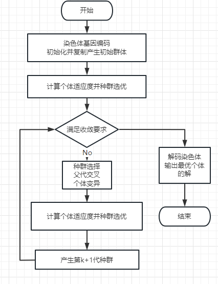
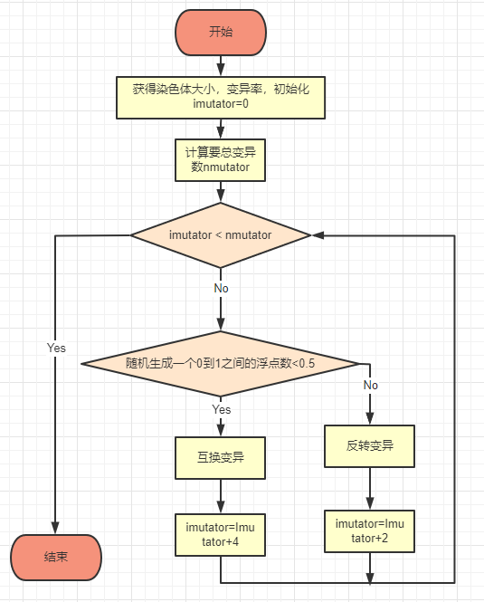
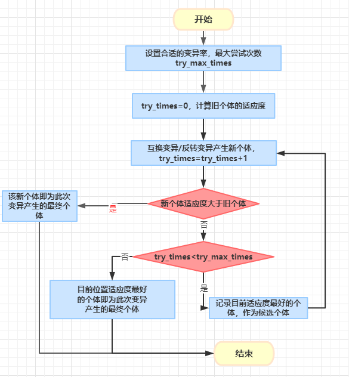

# Improved Genetic Algorithm with Favorable Mutator 

The genetic algorithm is an optimization algorithm that simulates natural selection and genetic mechanisms.
This project uses an improved genetic algorithm to search for the optimal solution or near-optimal solution to the Traveling Salesman Problem (TSP).

The flow chart of Genetic Algorithm:

    
     
    The flow chart of Genetic Algorithm
    

## Method

In nature, variation can be divided into favorable and unfavorable mutations. 
Unfavorable mutations may lead to congenital genetic diseases and reduce the survival of new individuals;
while favorable mutations can increase the adaptability of new individuals to the environment. 
Inspired by this, this project proposes a favorable mutation algorithm based on greedy search. 
The core idea is to try to ensure that every mutation is favorable.

    
     
    The basic mutator frame
    

    
     
    
The implementation of favorable mutator

Favorable mutator guarantees that every time the new individual produced by mutation is better than their parents, 
or at least the best one among all attempts. 
This greatly improves the effectiveness of mutation and enables the algorithm to converge to the optimal solution faster.

PS: The code is based on the MIT open source GAlib library. And this is just a simple trick but effective to improve GA for TSP, if you have somthing to share, please feel free to leave an issue.
